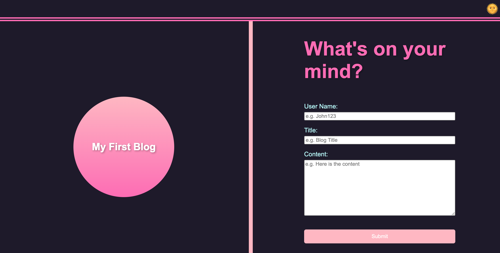

# Personal Blog Project



**Blog Project** is a web application designed to create and manage blog posts. It features a simple user interface with functionality for light/dark mode toggling, form submissions, and a responsive design.

**Visit The Deployed Application:** https://breannacamacho.github.io/personal-blog/

## Features

- **Light/Dark Mode Toggle:** Switch between light and dark themes using the sun/moon emoji button in the header.
- **Add Blog Posts:** Submit new blog posts using the form provided on the right side of the page.
- **Responsive Design:** The application adjusts to various screen sizes for an optimal viewing experience.

## Technologies Used

- **HTML:** Structure and content presentation.
- **CSS:** Styling and layout design with support for light and dark themes.
- **JavaScript:** Handles form submissions, theme toggling, and other interactive features.
- **Git:** Version control for tracking changes and collaboration.
- **GitHub:** Hosting repository for codebase and version history.

## Installation

1. Clone the repository:

    ```bash
    git clone https://github.com/breannacamacho/personal-blog.git
    ```

2. Navigate to the project directory:

    ```bash
    cd blog-project
    ```

3. Open `index.html` in your web browser to use the app.

## Usage

1. Open the `index.html` file in your browser to view the application.
2. Click the sun/moon emoji in the header to toggle between light and dark modes.
3. Use the form on the right side of the page to add new blog posts.
4. View and manage blog posts with styling that adapts to the selected theme.

## Contributing

Contributions are welcome! To contribute:

1. Fork the repository.
2. Create a new branch: `git checkout -b feature/YourFeature`
3. Commit your changes: `git commit -m 'Add some feature'`
4. Push to the branch: `git push origin feature/YourFeature`
5. Open a pull request.
